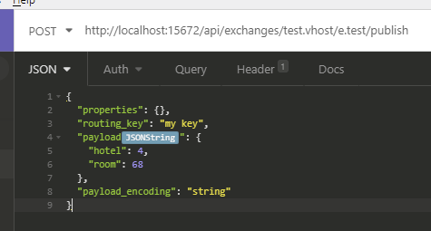
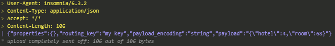

# Inception plugin for Insomnia
Plugin for Insomnia to encode json as json string property.
Insomnia is a REST/HTTP client: https://github.com/getinsomnia/insomnia

## Use case
Many APIs are "envelope" APIs, that is they have a JSON model and are used to carry a client-defined payload. Some clients would use JSON for the payload and need to write JSON (payload) as a string value for a JSON (model) property.

This plugin allows writing un-encoded JSON in the body editor to benefit from features like syntax highlighting and beautify.

## Installation
Inception plugin can be installed like any other plugin: [Managing Insomnia Plugins](https://support.insomnia.rest/article/26-plugins#managing-plugins).
The node package name is **insomnia-plugin-inception**.

## Usage
Place the **JSONString** [template tag](https://support.insomnia.rest/article/40-template-tags) in the name of the property which needs encoding.

This is an example to publish a message with JSON payload in [RabbitMQ Management API](https://cdn.rawgit.com/rabbitmq/rabbitmq-management/v3.7.14/priv/www/api/index.html):

When the request is sent the property is encoded:

